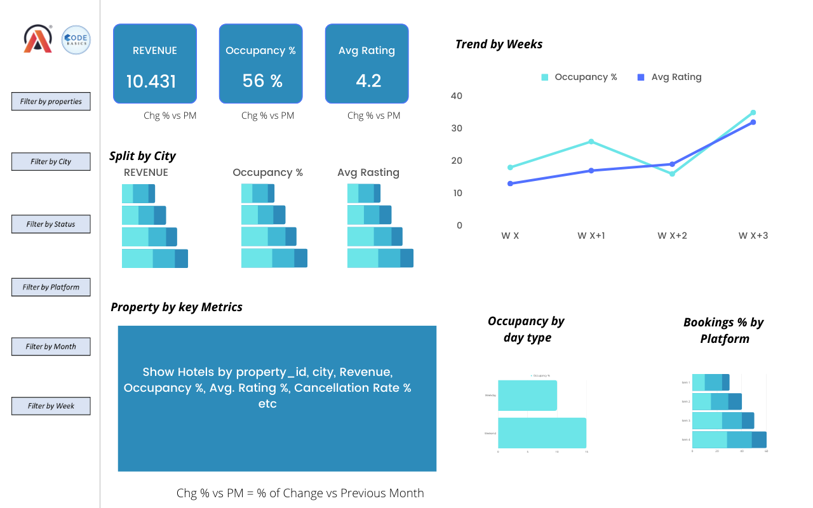
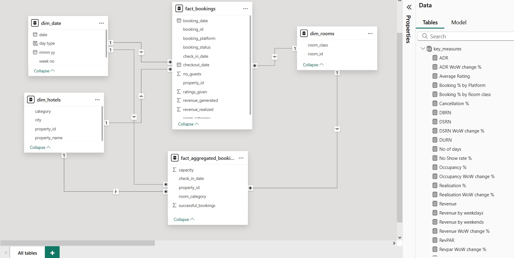
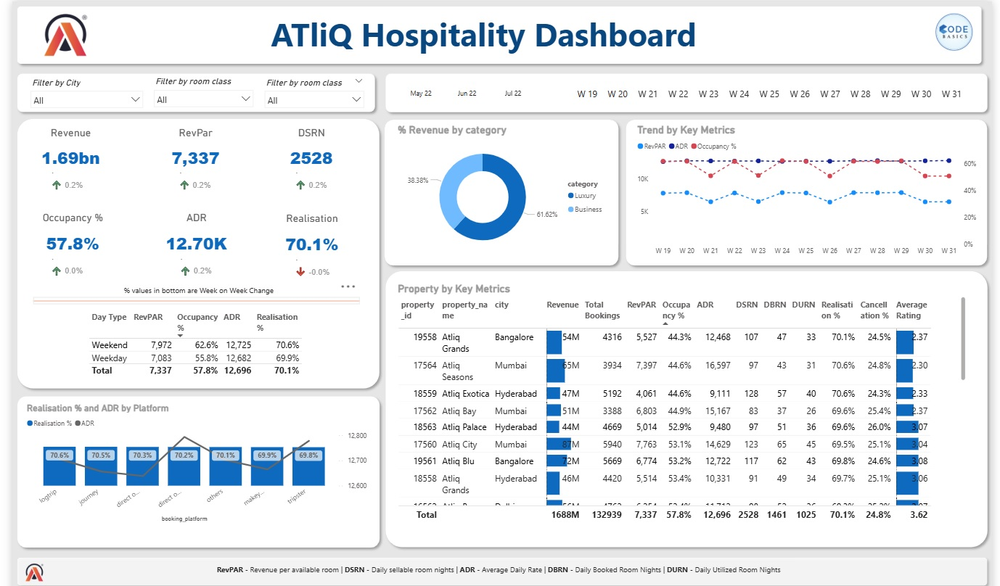
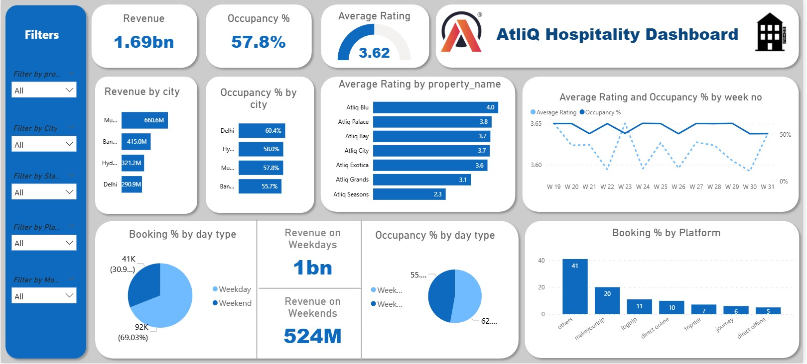

# AtilQ-Hospitality-Insights

## Problem Statement

AtliQ Grands owns multiple five-star hotels across India. They have been in the hospitality industry for the past 20 years. Due to strategic moves from other competitors and ineffective decision-making in management, AtliQ Grands are losing its market share and revenue in the luxury/business hotels category. As a strategic move, the managing director of AtliQ Grands wanted to incorporate “Business and Data Intelligence” to regain their market share and revenue. However, they do not have an in-house data analytics team to provide them with these insights.

Their revenue management team had decided to hire a 3rd party service provider to provide them with insights from their historical data.
## Task

You are a data analyst who has been provided with sample data and a mock-up dashboard to work on the following task. You can download all relevant documents from the download section.
Create the metrics according to the metric list.
Create a dashboard according to the mock-up provided by stakeholders.
Create relevant insights that are not provided in the metric list/mock-up dashboard.

## Provided Mock-up Dashboard

## Data Model and Measures

## Main Dashboard

## Dashboard 2nd View

## Project Learnings and Insights

### Project: Revenue Insights in Hospitality Domain

### Key Learnings:

**Custom Visuals:**

Developed a calendar-style visual using the matrix table, enhancing date-based analysis capabilities for bookings and revenue trends.

**Business Understanding:**

Gained insights into hotel cancellation policies, noting that:
- Most hotels offer zero cancellation charges if canceled more than 3 months in advance.
- Post this period, cancellation charges typically range from 60% to 90% of the booking amount.

**Power BI Techniques:**

- Implemented Bookmarks and Selection Pane for interactive report navigation and storytelling.
- Applied a consistent color palette throughout the dashboard to maintain visual coherence.

### Data Insights:

**Top Performing City:**

Mumbai led in revenue generation with ₹669 Million, followed by Bangalore, Hyderabad, and Delhi.

**Property Performance:**

- AtliQ Exotica outperformed all 7 property types with:
- Revenue: ₹320 Million
- Rating: 3.62
- Occupancy: 57%
- Cancellation Rate: 24.4%
- AtliQ Bay achieved the highest occupancy rate of 66%.

**Time-Based Insights:**

- Week 24 registered the highest revenue of ₹139.6 Million across the timeline.

**City Performance Comparison:**

- Delhi ranks highest in both occupancy and customer ratings, followed by Hyderabad, Mumbai, and Bangalore.

**Revenue Losses:**

- AtliQ hotels faced a revenue loss of ₹298 Million due to cancellations.

**Room Type Trends:**
- Elite rooms received the most bookings, but also experienced the highest cancellation rate.

## Final Most Important Recomendation
- As it is found that the hotel chain is missing its pricing strategy, as they have not made different prices for weekday and weekend days and not for different type of hotels on the basis of their ratings.
- Also they have not settled the prices strategy for booking platform like they have no differenciation for their on platform.
- But it is not recommended to change the price for differenct platforms but to give promotional offers.
- Similarly divice promotion offer strategy for week and weekend days and hotels for different ratings.
- So overall there is a need of promotional strategy
